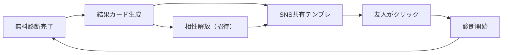
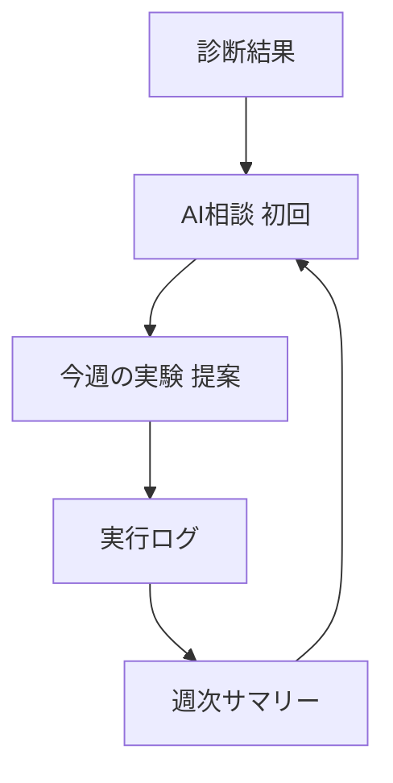

# Personality Platform - 性格診断×AI相談プラットフォーム

**「診断で入口、AI相談で継続価値」**
性格診断をエンタメとして拡散させ、AI相談で意思決定支援と行動設計を提供する統合プラットフォーム。

[](https://nextjs.org/)
[](https://www.typescriptlang.org/)
[](./LICENSE)

---

## 🎯 プロダクトコンセプト

### 中核UX：「決めつけない設計」

流行している性格診断の課題は「決めつけが嫌」という拒否反応（約5割）と、過信による誤用リスク。
本プラットフォームは、診断結果を「ラベル」ではなく「行動改善のきっかけ」として設計し、継続的な成長支援に繋げます。

### 入口と出口の設計

- **入口（無料）**：SNSで拡散できる軽量診断（恋愛・相性・コミュニケーション）
- **出口（有料）**：AI相談による具体的な行動設計（就活・人間関係・セルフケア）

---

## 📊 市場機会

### 需要シグナル

- **検索需要**：「MBTI診断」単体で月277万回、関連キーワード合計で月2,500万回規模（推定）
- **Z世代の実施率**：認知67.3%、実施41.3%（18-29歳女性）
- **成長市場**：
  - HRTechクラウド：2024年度 1,385億円（年25-30%成長予測）
  - セルフヘルスケア：2024年 7兆1,190億円
  - メンタルヘルス：2025年 275億米ドル（CAGR 3.6%）

### 競合との差別化

| 競合 | 強み | 空白（本プロダクトの差別化） |
|---|---|---|
| 16Personalities | 大規模トラフィック・SEO | AI相談による継続価値が薄い |
| mgram | 単発課金が確立 | 週次サマリー・行動実験など継続支援がない |
| 公式MBTI | 信頼性・セッション型 | 拡散性が低い・価格が高い（13,195円） |
| ミイダス | B2B統合 | 性格診断専業の体験最適化ではない |

**本プラットフォームの独自価値**：診断結果を「今週の実験」に落とし、AI相談で振り返る継続ループを構築。

---

## 🚀 技術スタック

### フロントエンド

- **Next.js 15** (App Router + Server Actions)
- **TypeScript 5.9**
- **Tailwind CSS 3**
- **shadcn/ui** (UIコンポーネント)
- **@vercel/og** (OG画像生成)

### バックエンド

- **Prisma** (ORM)
- **PostgreSQL** (Supabase推奨)
- **Vercel AI SDK** (ストリーミング対応)

### AI統合

- **OpenAI GPT** または **Anthropic Claude**
- **Vercel AI SDK** (チャットストリーミング)

### 認証・決済

- **Clerk** (認証)
- **Stripe** (サブスク + 単発課金 + クレジット販売)

### 分析・通知

- **PostHog** または **Mixpanel** (ファネル分析)
- **Web Push API** (プッシュ通知)

---

## 📋 提供する診断テスト（優先順位順）

### Phase 1: MVP（2-4週間）

1. **恋愛・相性診断** 🔥 優先度P0
   - バイラル性+課金率が最高
   - 2人分析で「相性」「会話プロンプト」生成
   - 招待リンクで相性機能解放（バイラルループ）

2. **仕事・役割診断** 📊 優先度P1
   - B2B転用の母体
   - 上司/部下相性、1on1台本生成

### Phase 2: 拡張（5-8週間）

3. **コミュニケーション診断** 💬 優先度P1
   - 衝突パターン、謝り方、依頼の仕方
   - AI相談と直結（テンプレ生成）

4. **ストレス・回復診断** 🌿 優先度P2
   - 燃え尽き、回避癖、休息タイプ
   - 継続価値（週次運用）に向く

### Phase 3: 最適化（9-12週間）

5. **価値観診断** 💎 優先度P2
   - お金/時間/承認/自由の優先順位
   - マッチング・キャリア提案に展開

**重要な設計方針**：
- **MBTI商標リスク回避**：「MBTI」を名乗らず、Big Five等の学術枠組みをベースに独自ネーミングで展開
- **学術的整合性**：Big Five（日本語尺度TIPI-J等）をベースに短縮版を設計

---

## 💰 収益モデル

### toC（個人向け）

| プラン | 価格 | 主要価値 | 転換率目標 |
|--------|------|----------|-----------|
| **Free** | 0円 | 診断（短縮版）+ 結果カード + AI相談（月3回）+ 相性（1人まで） | - |
| **Plus** | 980円/月<br>7,800円/年 | AI相談無制限 + 週次サマリー + 行動実験 + 履歴 + 相性（複数） | 0.8-3% |
| **Pro** | 1,480円/月 | Plus全部 + 月60往復 + 詳細レポート月1回 + 再診断 | - |
| **単発** | 780-1,980円/回 | 詳細PDFレポート、相性深掘り | 1.2% |
| **クレジット** | 980円/20回 | AI相談の追加枠（都度課金） | - |

### toB（法人向け）

| プラン | 価格 | 対象 |
|--------|------|------|
| **Team Lite** | 19,800円/月 | 5-30名、チーム相性+月次レポート |
| **Team Growth** | 49,800円/月+300円/人 | 30-200名、ダッシュボード+権限管理 |
| **Workshop Pack** | 98,000円/回 | 単発研修パッケージ |

**収益インパクト概算**（S=結果UU 10万/月の場合）：
- AI詳細レポート有料化：約+114万円/月
- 相性診断有料化：約+64万円/月
- トライアル最適化：約+78万円/月
- B2B（150名×5社）：約+45万円/月

---

## 🎨 UX/UI設計の要点

### バイラル設計

**共有フォーマット**（プロダクト要件として固定）：
- **1:1正方形カード**：タイプ名 + キャッチコピー + 強み3つ + 「決めつけ禁止」短文
- **9:16ストーリーズ**：保存されやすい自己紹介テンプレート
- **X投稿テンプレ**：140-200字自動生成（編集可）

**バイラルループ**：


### リテンション設計

**継続ループ**：


**診断が1回で終わらない施策**：
- 週次サマリー（AI生成：傾向/トリガー/次の一手）
- 「今週の実験」機能（1つだけ行動課題→次回レビュー）
- 再診断（30-90日で差分表示）
- 相性の定期アップデート

---

## 🏗️ プロジェクト構造

```
personality-platform/
├── app/                      # Next.js App Router
│   ├── (auth)/              # 認証関連ページ
│   ├── (dashboard)/         # ユーザーダッシュボード
│   ├── tests/               # 診断テスト
│   │   ├── love-type/       # 恋愛・相性診断
│   │   ├── work-role/       # 仕事・役割診断
│   │   ├── communication/   # コミュニケーション診断
│   │   └── stress/          # ストレス・回復診断
│   ├── results/             # 診断結果ページ
│   ├── ai-chat/             # AI相談機能
│   └── api/                 # API Routes
├── components/              # Reactコンポーネント
│   ├── ui/                 # shadcn/ui
│   ├── tests/              # 診断用コンポーネント
│   └── charts/             # 結果表示用グラフ
├── lib/                     # ユーティリティ
│   ├── db/                 # Prisma client
│   ├── ai/                 # AI統合（プロンプト設計）
│   └── tests/              # 診断ロジック（Big Fiveベース）
├── types/                   # TypeScript型定義
├── data/                    # 診断データ・質問セット
├── prisma/                  # DBスキーマ
├── docs/                    # 設計ドキュメント
│   ├── project-plan-v2.md
│   ├── database-schema.md
│   ├── api-design.md
│   ├── ai-prompt-design.md
│   └── pricing-experiment-plan.md
└── public/                  # 静的ファイル
```

---

## 🛠️ セットアップ

```bash
# 依存関係のインストール
npm install

# 環境変数の設定
cp .env.example .env.local
# .env.local に以下を設定：
# - DATABASE_URL
# - OPENAI_API_KEY or ANTHROPIC_API_KEY
# - NEXT_PUBLIC_CLERK_PUBLISHABLE_KEY
# - CLERK_SECRET_KEY
# - STRIPE_SECRET_KEY
# - STRIPE_WEBHOOK_SECRET

# データベースのマイグレーション
npx prisma migrate dev

# 開発サーバー起動
npm run dev
```

開発サーバーは http://localhost:3000 で起動します。

---

## 📊 KPI設計（最小セット）

### 獲得

- **share/user**（共有率）
- **招待→診断開始率**
- **紹介経由比率**

### 活性

- **診断完了率**
- **相談開始率**
- **週次アクティブ率**

### 収益

- **無料→課金CVR**（目標0.8-3%）
- **ARPPU**（2,000-5,000円）
- **解約率**（チャーン）

### 品質

- **「決めつけ」ネガ反応率**
- **通報率**

---

## 🗺️ 開発ロードマップ

### Phase 1: MVP + バイラル導線（2-4週間、P0）

- [x] プロジェクト初期化
- [x] 基本構造作成
- [x] トップページ実装
- [ ] **恋愛・相性診断**（Big Fiveベース短縮版）
- [ ] **結果カード生成**（1:1正方形 + 9:16ストーリーズ）
- [ ] **SNS共有テンプレ**（X/Instagram）
- [ ] **招待リンクで相性機能解放**
- [ ] **AI相談テンプレ**（回数制限付き）
- [ ] **認証**（Clerk）

### Phase 2: 課金+リテンション（5-8週間、P1）

- [ ] Stripe決済（サブスク+単発+クレジット）
- [ ] 週次サマリー（AI生成）
- [ ] 「今週の実験」行動提案機能
- [ ] 7日間無料トライアル
- [ ] 仕事・役割診断の追加

### Phase 3: SEO+拡張（9-12週間、P1-P2）

- [ ] タイプ別SEOページ量産
- [ ] コミュニケーション診断の追加
- [ ] 再診断+差分表示
- [ ] 生成コンテンツ（自己紹介カード）
- [ ] PDF詳細レポート

### Phase 4: B2B（13週目〜）

- [ ] Team Liteセルフサーブ
- [ ] チームダッシュボード
- [ ] Slack/CSV連携

---

## 📚 ドキュメント

### 戦略・計画

- [プロジェクト計画書 v2](./docs/project-plan-v2.md) - リサーチ結果を反映した全面更新版
- [収益化戦略（旧版）](./MONETIZATION_STRATEGY.md)
- [価格実験計画](./docs/pricing-experiment-plan.md)

### 設計

- [データベーススキーマ](./docs/database-schema.md) - Prismaモデル設計
- [API設計書](./docs/api-design.md) - エンドポイント一覧
- [AIプロンプト設計](./docs/ai-prompt-design.md) - AI相談のプロンプト設計

### リサーチ

- 市場調査レポート（内部資料）
- 差別化・成長戦略レポート（内部資料）
- 収益最大化分析レポート（内部資料）

---

## ⚠️ リスク対策

### MBTI商標リスク

- 「MBTI」を名乗らない
- Big Five等の学術枠組みをベースにした独自ネーミング
- 注意書き：「本診断は公式MBTIではありません」

### 決めつけ嫌悪

- 結果を「傾向」「状況で変わる」「成長可能」として表現
- ラベルではなく行動支援に焦点

### 課金トラブル

- 返金ポリシー明記
- 解約導線の明確化
- トライアル期間の適切な設計

### プロファイリング・透明性

- 何を根拠にどう出したかを説明
- 削除権の提供
- 学習オプトアウト

---

## 🎯 成功指標（1年後目標）

### 保守的目標

- MAU: 30,000人
- 有料ユーザー: 600人
- MRR: ¥600,000
- 年間収益: ¥7,200,000

### チャレンジ目標

- MAU: 100,000人
- 有料ユーザー: 3,000人
- MRR: ¥3,000,000
- 年間収益: ¥36,000,000

---

## 🤝 コントリビューション

本プロジェクトは個人開発ですが、提案・フィードバックは歓迎します。

---

## 📄 ライセンス

ISC

---

## 🔗 リンク

- [GitHub Repository](https://github.com/Ezark213/personality-platform)
- [デモサイト](https://personality-platform.vercel.app)（準備中）

---

**Built with ❤️ using Next.js and Claude AI**
