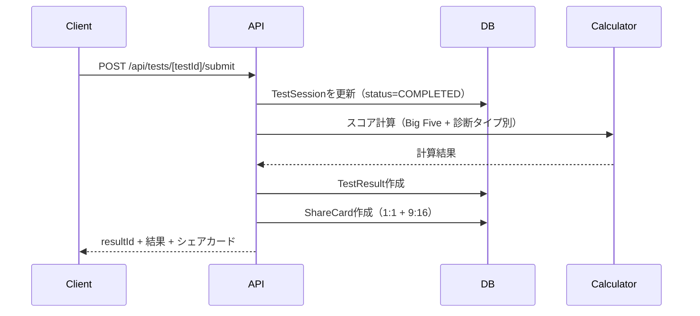
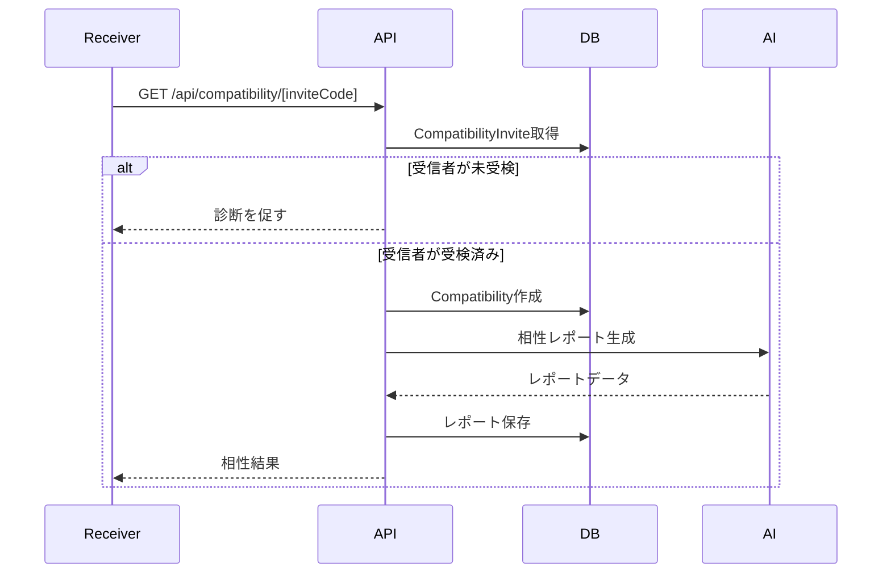

# API設計書

## 概要

Next.js App Router (Route Handlers + Server Actions) を前提としたAPI設計。
診断、AI相談、相性、課金、B2Bの各機能をカバー。

---

## エンドポイント一覧

### 診断系

| メソッド | エンドポイント | 説明 |
|---------|--------------|------|
| POST | `/api/tests/[testId]/start` | 受検開始 |
| POST | `/api/tests/[testId]/submit` | 回答送信+スコア算出 |
| GET | `/api/tests/[testId]/result/[resultId]` | 結果取得 |
| GET | `/api/tests/[testId]/questions` | 設問取得 |

### 共有・バイラル系

| メソッド | エンドポイント | 説明 |
|---------|--------------|------|
| GET | `/api/share/[resultId]/card` | OG画像生成 |
| POST | `/api/compatibility/invite` | 相性招待リンク生成 |
| GET | `/api/compatibility/[inviteCode]` | 招待受入+相性算出 |
| GET | `/api/compatibility/[compatibilityId]` | 相性レポート取得 |

### AI相談系

| メソッド | エンドポイント | 説明 |
|---------|--------------|------|
| POST | `/api/ai/chat` | AI相談（Gemini 2.5 Flash、ストリーミング） |
| GET | `/api/ai/conversations` | 会話一覧取得 |
| GET | `/api/ai/conversations/[id]` | 会話詳細取得 |
| POST | `/api/ai/conversations/[id]/summarize` | 会話要約生成（5往復ごと、トークン削減） |
| POST | `/api/ai/insights/save` | インサイトブックマーク保存 |
| GET | `/api/ai/insights` | 保存済みインサイト一覧取得 |
| POST | `/api/ai/weekly-summary` | 週次サマリー生成（Phase 2）|
| POST | `/api/ai/action-experiment` | 今週の実験の提案/振り返り（Phase 2）|

### 課金系

| メソッド | エンドポイント | 説明 |
|---------|--------------|------|
| POST | `/api/billing/checkout` | Stripeチェックアウト |
| POST | `/api/billing/webhook` | Stripe Webhook |
| POST | `/api/billing/credits/purchase` | クレジット購入 |
| GET | `/api/billing/usage` | 利用量確認 |
| POST | `/api/billing/portal` | Stripe Billing Portal |

### B2B系

| メソッド | エンドポイント | 説明 |
|---------|--------------|------|
| POST | `/api/teams/create` | チーム作成 |
| POST | `/api/teams/[teamId]/invite` | メンバー招待 |
| GET | `/api/teams/[teamId]/dashboard` | チームダッシュボード |
| GET | `/api/teams/[teamId]/members` | メンバー一覧 |
| GET | `/api/teams/[teamId]/reports` | レポート一覧 |

---

## 詳細仕様

## 診断系

### POST `/api/tests/[testId]/start`

**説明**：受検セッションを開始

**リクエスト**：
```typescript
// パスパラメータ
testId: string  // 例："love-compatibility"

// ボディ（任意）
{
  inviteCode?: string  // 招待リンク経由の場合
}
```

**レスポンス**：
```typescript
{
  sessionId: string
  test: {
    id: string
    type: string
    name: string
    totalQuestions: number
  }
  questions: Question[]  // 全設問（または最初の1問）
}

interface Question {
  id: number
  text: string
  dimension: string  // 例："extraversion"
  direction: 1 | -1
}
```

**認証**：任意（ゲストも可、Clerkトークンがあればユーザー紐付け）

---

### POST `/api/tests/[testId]/submit`

**説明**：回答送信とスコア算出

**リクエスト**：
```typescript
// パスパラメータ
testId: string

// ボディ
{
  sessionId: string
  answers: Answer[]
}

interface Answer {
  questionId: number
  value: number  // 1-5（リッカート尺度）
}
```

**レスポンス**：
```typescript
{
  resultId: string
  result: {
    type: string  // 例："内省的な戦略家"
    summary: string  // 3行要約
    scores: {
      openness: number  // 0-100
      conscientiousness: number
      extraversion: number
      agreeableness: number
      neuroticism: number
    }
    scoresData: Record<string, any>  // 診断タイプ別の追加データ
  }
  shareCards: {
    square: string  // URL
    story: string   // URL
  }
}
```

**処理フロー**：


---

### GET `/api/tests/[testId]/result/[resultId]`

**説明**：診断結果の取得

**リクエスト**：
```typescript
// パスパラメータ
testId: string
resultId: string
```

**レスポンス**：
```typescript
{
  id: string
  test: {
    type: string
    name: string
  }
  result: {
    type: string
    summary: string
    scores: BigFiveScores
    scoresData: Record<string, any>
    strengths: string[]
    weaknesses: string[]
    careers: string[]  // おすすめキャリア
  }
  shareCards: {
    square: string
    story: string
  }
  createdAt: string
}
```

**認証**：なし（resultIdが秘密の役割）

---

## 共有・バイラル系

### GET `/api/share/[resultId]/card`

**説明**：OG画像生成（Twitter Card / Facebook OGP用）

**リクエスト**：
```typescript
// パスパラメータ
resultId: string

// クエリパラメータ
format?: "square" | "story"  // デフォルト: "square"
```

**レスポンス**：
```typescript
// Content-Type: image/png
// 画像データ（バイナリ）
```

**実装**：`@vercel/og`使用

```typescript
// app/api/share/[resultId]/card/route.tsx
import { ImageResponse } from '@vercel/og'

export async function GET(
  request: Request,
  { params }: { params: { resultId: string } }
) {
  const result = await getTestResult(params.resultId)

  return new ImageResponse(
    (
      <div style={{
        width: '100%',
        height: '100%',
        display: 'flex',
        flexDirection: 'column',
        alignItems: 'center',
        justifyContent: 'center',
        backgroundColor: '#fff',
      }}>
        <h1>{result.type}</h1>
        <p>{result.summary}</p>
        {/* ... */}
      </div>
    ),
    {
      width: 1200,
      height: 630,
    }
  )
}
```

---

### POST `/api/compatibility/invite`

**説明**：相性診断の招待リンク生成

**リクエスト**：
```typescript
{
  testType: string  // 例："love-compatibility"
  resultId: string  // 送信者の診断結果ID
}
```

**レスポンス**：
```typescript
{
  inviteCode: string  // UUID
  inviteUrl: string   // 例：https://personality-platform.com/invite/abc123
  expiresAt: string   // ISO8601
}
```

**認証**：必須（Clerk）

---

### GET `/api/compatibility/[inviteCode]`

**説明**：招待受入+相性算出

**リクエスト**：
```typescript
// パスパラメータ
inviteCode: string
```

**レスポンス**：
```typescript
{
  invite: {
    sender: {
      name: string
    }
    testType: string
  }
  receiverHasCompleted: boolean  // 受信者が既に受検済みか
  compatibility?: {
    id: string
    score: number  // 0-100
    report: {
      similarities: string[]
      differences: string[]
      conflictPoints: string[]
      conversationPrompts: ConversationPrompt[]
    }
  }
}

interface ConversationPrompt {
  situation: string
  user1Approach: string
  user2Approach: string
  suggestion: string
}
```

**処理フロー**：


---

## AI相談系

### POST `/api/ai/chat`

**説明**：AI相談（Gemini 2.5 Flash、ストリーミング対応）

**リクエスト**：
```typescript
{
  conversationId?: string  // 既存会話に追加する場合
  message: string          // ユーザーメッセージ
  theme: 'career' | 'relationships' | 'growth'  // 相談テーマ
  suggestionChip?: string  // サジェスチョンチップから送信した場合
}
```

**レスポンス**：
```typescript
// Content-Type: text/event-stream (Server-Sent Events)

// イベント例：
data: {"type":"token","content":"こんにちは"}
data: {"type":"token","content":"！"}
data: {"type":"done","conversationId":"abc123","messageId":"msg456","suggestionChips":["次は...","もっと..."]}
```

**実装**：Gemini 2.5 Flash使用（5層プロンプト構造）

```typescript
// app/api/ai/chat/route.ts
import { GoogleGenerativeAI } from '@google/generative-ai'
import { buildSystemPrompt } from '@/lib/ai/prompt-builder'

export async function POST(req: Request) {
  const { conversationId, message, theme } = await req.json()
  const userId = await getCurrentUserId()

  // BigFiveスコア取得
  const bigFiveScores = await getBigFiveScores(userId)
  const personalityType = await getPersonalityType(userId)

  // 5層システムプロンプト構築
  const systemPrompt = buildSystemPrompt({
    bigFiveScores,
    personalityType,
    theme
  })

  // Gemini API初期化
  const genAI = new GoogleGenerativeAI(process.env.GEMINI_API_KEY!)
  const model = genAI.getGenerativeModel({
    model: 'gemini-2.5-flash',
    systemInstruction: systemPrompt
  })

  // 会話履歴取得
  const history = conversationId
    ? await getConversationHistory(conversationId)
    : []

  // 会話開始（ストリーミング）
  const chat = model.startChat({ history })
  const result = await chat.sendMessageStream(message)

  // ストリーミングレスポンス
  return new Response(
    new ReadableStream({
      async start(controller) {
        for await (const chunk of result.stream) {
          const text = chunk.text()
          controller.enqueue(
            new TextEncoder().encode(`data: ${JSON.stringify({ type: 'token', content: text })}\n\n`)
          )
        }
        controller.enqueue(
          new TextEncoder().encode(`data: ${JSON.stringify({ type: 'done', conversationId, messageId })}\n\n`)
        )
        controller.close()
      }
    }),
    {
      headers: {
        'Content-Type': 'text/event-stream',
        'Cache-Control': 'no-cache',
        'Connection': 'keep-alive'
      }
    }
  )
}
```

**システムプロンプト構造（5層）**：
```typescript
// lib/ai/prompt-builder.ts
export function buildSystemPrompt(params: {
  bigFiveScores: BigFiveScores
  personalityType: string
  theme: 'career' | 'relationships' | 'growth'
}): string {
  // Layer 1: ROLE
  const role = `あなたはココロ、若い大人向けの温かく洞察力のある性格コンサルタントです。
  丁寧でカジュアルな日本語（です/ます + 温かさ）で話します。
  顔文字を自然に使います。支援的な先輩であり、講師ではありません。`

  // Layer 2: USER CONTEXT
  const context = `ユーザーのBigFiveスコア:
  開放性 ${params.bigFiveScores.openness}/100
  誠実性 ${params.bigFiveScores.conscientiousness}/100
  外向性 ${params.bigFiveScores.extraversion}/100
  協調性 ${params.bigFiveScores.agreeableness}/100
  神経症傾向 ${params.bigFiveScores.neuroticism}/100
  性格タイプ: ${params.personalityType}`

  // Layer 3: ADAPTIVE STYLE
  const style = buildAdaptiveStyle(params.bigFiveScores)

  // Layer 4: THEME CONTEXT
  const themeContext = getThemeContext(params.theme)

  // Layer 5: SAFETY
  const safety = `クライシス検出キーワード: 「死にたい」「消えたい」など
  → すぐにクライシスリソースを提供（いのちの電話: 0120-783-556）
  診断はしない。人生を変える指示は出さない。
  アドバイスは探索としてフレーミングする。`

  return `${role}\n\n${context}\n\n${style}\n\n${themeContext}\n\n${safety}`
}
```

**認証**：必須（Clerk）

**レート制限**：
- FREE: 月3回
- PLUS/Standard: 無制限（API制限内）
- PRO/Premium: 優先キュー + Flash vs Flash-Lite

**Gemini API制限**（無料枠）：
- Flash: ~250 RPD, 10 RPM
- Flash-Lite: 1,000 RPD, 15 RPM
- 有料Tier 1: ~1,500 RPD, $0.30/100万トークン

**会話履歴管理**：
- 5往復ごとに要約してトークン削減（60-70%削減）
- `/api/ai/conversations/[id]/summarize` で要約生成

---

### POST `/api/ai/conversations/[id]/summarize`

**説明**：会話要約生成（トークン削減のため、5往復ごとに実行）

**リクエスト**：
```typescript
// パスパラメータ
conversationId: string

// ボディ
{
  lastNMessages?: number  // デフォルト: 10（5往復）
}
```

**レスポンス**：
```typescript
{
  summary: string
  originalTokens: number
  summarizedTokens: number
  reductionPercent: number  // 削減率（例: 65%）
}
```

**処理フロー**：
1. 最新N件のメッセージを取得
2. Gemini Flash-Liteで要約生成（コスト削減）
3. 元のメッセージを要約で置き換え
4. トークン数を比較してレスポンス

**認証**：必須（Clerk）

---

### POST `/api/ai/insights/save`

**説明**：重要なAIメッセージをインサイトとしてブックマーク

**リクエスト**：
```typescript
{
  messageId: string
  conversationId: string
  insightText: string
  category?: 'career' | 'relationships' | 'growth'
}
```

**レスポンス**：
```typescript
{
  insightId: string
  savedAt: string
}
```

**認証**：必須（Clerk）

---

### GET `/api/ai/insights`

**説明**：保存済みインサイト一覧取得

**クエリパラメータ**：
```typescript
{
  category?: 'career' | 'relationships' | 'growth'
  limit?: number  // デフォルト: 20
  offset?: number  // デフォルト: 0
}
```

**レスポンス**：
```typescript
{
  insights: {
    id: string
    text: string
    category: string
    conversationId: string
    savedAt: string
  }[]
  total: number
}
```

**認証**：必須（Clerk）

---

### POST `/api/ai/weekly-summary`

**説明**：週次サマリー生成

**リクエスト**：
```typescript
{
  weekStart: string  // ISO8601（例："2026-03-17"）
}
```

**レスポンス**：
```typescript
{
  summary: {
    trends: string[]       // 傾向
    triggers: string[]     // トリガー
    nextActions: string[]  // 次の一手
  }
  generatedAt: string
}
```

**処理フロー**：
1. 指定週のAI会話ログを取得
2. AIにサマリー生成を依頼
3. WeeklySummaryテーブルに保存
4. レスポンス返却

**認証**：必須（Clerk）

---

### POST `/api/ai/action-experiment`

**説明**：今週の実験の提案/振り返り

**リクエスト（提案）**：
```typescript
{
  action: "propose"
}
```

**レスポンス**：
```typescript
{
  experiment: {
    id: string
    title: string
    description: string
    proposedAt: string
  }
}
```

**リクエスト（振り返り）**：
```typescript
{
  action: "reflect"
  experimentId: string
  reflection: string  // ユーザーの振り返り
}
```

**レスポンス**：
```typescript
{
  experiment: {
    id: string
    status: "completed"
    completedAt: string
  }
  nextProposal?: {
    title: string
    description: string
  }
}
```

---

## 課金系

### POST `/api/billing/checkout`

**説明**：Stripeチェックアウトセッション作成

**リクエスト**：
```typescript
{
  plan: "plus" | "pro"
  interval: "month" | "year"
}

// または

{
  product: "credits-20" | "credits-60" | "report-detail"
}
```

**レスポンス**：
```typescript
{
  sessionId: string  // Stripe Checkout Session ID
  url: string        // リダイレクト先URL
}
```

**実装**：
```typescript
import Stripe from 'stripe'

const stripe = new Stripe(process.env.STRIPE_SECRET_KEY!)

export async function POST(req: Request) {
  const { plan, interval } = await req.json()
  const { userId } = auth()

  // 価格ID取得
  const priceId = getPriceId(plan, interval)

  // チェックアウトセッション作成
  const session = await stripe.checkout.sessions.create({
    mode: 'subscription',
    payment_method_types: ['card'],
    line_items: [{
      price: priceId,
      quantity: 1,
    }],
    success_url: `${process.env.NEXT_PUBLIC_URL}/billing/success?session_id={CHECKOUT_SESSION_ID}`,
    cancel_url: `${process.env.NEXT_PUBLIC_URL}/billing/cancel`,
    client_reference_id: userId,
  })

  return NextResponse.json({
    sessionId: session.id,
    url: session.url,
  })
}
```

---

### POST `/api/billing/webhook`

**説明**：Stripe Webhookイベント処理

**リクエスト**：
```typescript
// Stripeから送信されるイベントデータ（署名検証必須）
```

**処理イベント**：
- `checkout.session.completed`：初回課金完了
- `invoice.payment_succeeded`：課金成功
- `invoice.payment_failed`：課金失敗
- `customer.subscription.updated`：サブスク更新
- `customer.subscription.deleted`：サブスク解約

**実装**：
```typescript
export async function POST(req: Request) {
  const body = await req.text()
  const sig = req.headers.get('stripe-signature')!

  let event: Stripe.Event

  try {
    event = stripe.webhooks.constructEvent(
      body,
      sig,
      process.env.STRIPE_WEBHOOK_SECRET!
    )
  } catch (err) {
    return NextResponse.json({ error: 'Webhook signature verification failed' }, { status: 400 })
  }

  switch (event.type) {
    case 'checkout.session.completed':
      await handleCheckoutSessionCompleted(event.data.object)
      break
    case 'invoice.payment_succeeded':
      await handleInvoicePaymentSucceeded(event.data.object)
      break
    // ...
  }

  return NextResponse.json({ received: true })
}
```

---

### GET `/api/billing/usage`

**説明**：利用量確認

**リクエスト**：
```typescript
// なし（認証ユーザーの情報を取得）
```

**レスポンス**：
```typescript
{
  subscription: {
    plan: "plus"
    status: "active"
    currentPeriodEnd: string
  }
  aiChat: {
    limit: 20
    used: 7
    remaining: 13
  }
  credits: {
    balance: 15
  }
}
```

---

## B2B系

### POST `/api/teams/create`

**説明**：チーム作成

**リクエスト**：
```typescript
{
  name: string
  plan: "team-lite" | "team-growth"
}
```

**レスポンス**：
```typescript
{
  team: {
    id: string
    name: string
    plan: string
  }
  checkoutUrl: string  // Stripe Checkout URL
}
```

---

### GET `/api/teams/[teamId]/dashboard`

**説明**：チームダッシュボード

**リクエスト**：
```typescript
// パスパラメータ
teamId: string
```

**レスポンス**：
```typescript
{
  team: {
    id: string
    name: string
    memberCount: number
  }
  stats: {
    completedTests: number
    avgScores: BigFiveScores
    departmentBreakdown: {
      department: string
      memberCount: number
      avgScores: BigFiveScores
    }[]
  }
  compatibility: {
    highCompatibility: { user1: string, user2: string, score: number }[]
    lowCompatibility: { user1: string, user2: string, score: number }[]
  }
  recommendations: string[]
}
```

---

## エラーハンドリング

### エラーレスポンス形式

```typescript
{
  error: {
    code: string     // 例："INVALID_INPUT"
    message: string  // ユーザー向けメッセージ
    details?: any    // デバッグ用詳細
  }
}
```

### エラーコード一覧

| コード | HTTPステータス | 説明 |
|--------|--------------|------|
| UNAUTHORIZED | 401 | 認証が必要 |
| FORBIDDEN | 403 | 権限不足 |
| NOT_FOUND | 404 | リソースが見つからない |
| INVALID_INPUT | 400 | 入力が不正 |
| RATE_LIMIT_EXCEEDED | 429 | レート制限超過 |
| PAYMENT_REQUIRED | 402 | 課金が必要 |
| INTERNAL_ERROR | 500 | サーバーエラー |

---

## レート制限

### AI相談

| プラン | 制限 | リセット |
|--------|------|---------|
| FREE | 月3回 | 月初（UTC） |
| PLUS | 月20回 | 月初（UTC） |
| PRO | 月60回 | 月初（UTC） |
| クレジット | 都度消費 | - |

### API全般

- 一般エンドポイント：ユーザーあたり100req/分
- 診断開始：ユーザーあたり10req/時
- Webhook：IP制限（Stripe IPのみ許可）

---

## CORS設定

```typescript
// next.config.ts
const nextConfig = {
  async headers() {
    return [
      {
        source: '/api/:path*',
        headers: [
          { key: 'Access-Control-Allow-Origin', value: process.env.NEXT_PUBLIC_URL },
          { key: 'Access-Control-Allow-Methods', value: 'GET, POST, PUT, DELETE, OPTIONS' },
        ],
      },
    ]
  },
}
```

---

## 認証フロー

### Clerkトークン検証

```typescript
// middleware.ts
import { authMiddleware } from '@clerk/nextjs'

export default authMiddleware({
  publicRoutes: [
    '/api/tests/:path*',    // 診断は未認証可
    '/api/share/:path*',    // 共有も未認証可
    '/api/billing/webhook', // Webhookは署名検証
  ],
})

export const config = {
  matcher: ['/((?!.*\\..*|_next).*)', '/', '/(api|trpc)(.*)'],
}
```

---

**更新日**：2026-03-18
**バージョン**：1.0
**作成者**：Claude Sonnet 4.5
