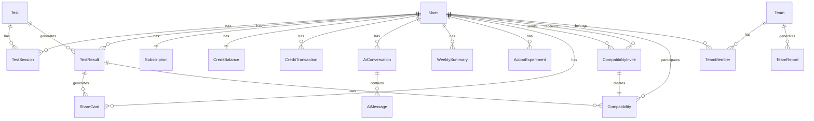

# データベーススキーマ設計

## 概要

Prisma ORMを使用したPostgreSQLデータベースのスキーマ設計。
リサーチから導出された機能要件（診断、相性、AI相談、週次サマリー、行動実験、サブスクリプション、クレジット管理、B2B）に対応。

---

## Prismaスキーマ（全体）

```prisma
// prisma/schema.prisma

generator client {
  provider = "prisma-client-js"
}

datasource db {
  provider = "postgresql"
  url      = env("DATABASE_URL")
}

// ========================================
// User & Auth
// ========================================

model User {
  id        String   @id @default(cuid())
  clerkId   String   @unique  // Clerk user ID
  email     String   @unique
  name      String?
  imageUrl  String?
  createdAt DateTime @default(now())
  updatedAt DateTime @updatedAt

  // Relations
  testSessions        TestSession[]
  testResults         TestResult[]
  aiConversations     AiConversation[]
  aiInsights          AiInsight[]           // ブックマークされたAIインサイト
  weeklySummaries     WeeklySummary[]
  actionExperiments   ActionExperiment[]
  shareCards          ShareCard[]
  subscription        Subscription?
  creditBalance       CreditBalance?
  creditTransactions  CreditTransaction[]

  // Compatibility
  sentInvites         CompatibilityInvite[] @relation("SentInvites")
  receivedInvites     CompatibilityInvite[] @relation("ReceivedInvites")
  compatibilities     Compatibility[]       @relation("UserCompatibilities")

  // B2B
  teamMemberships     TeamMember[]

  @@index([clerkId])
  @@index([email])
}

// ========================================
// Subscription & Billing
// ========================================

enum SubscriptionStatus {
  ACTIVE
  CANCELED
  PAST_DUE
  TRIALING
  INCOMPLETE
  INCOMPLETE_EXPIRED
  UNPAID
}

enum SubscriptionPlan {
  FREE
  PLUS
  PRO
}

model Subscription {
  id                  String              @id @default(cuid())
  userId              String              @unique
  user                User                @relation(fields: [userId], references: [id], onDelete: Cascade)

  plan                SubscriptionPlan    @default(FREE)
  status              SubscriptionStatus  @default(ACTIVE)

  // Stripe
  stripeCustomerId    String?             @unique
  stripeSubscriptionId String?            @unique
  stripePriceId       String?
  stripeCurrentPeriodStart DateTime?
  stripeCurrentPeriodEnd   DateTime?
  stripeCancelAtPeriodEnd  Boolean        @default(false)

  // Limits
  aiChatMonthlyLimit  Int                 @default(3)   // FREE: 3, PLUS: 20, PRO: 60
  aiChatUsedThisMonth Int                 @default(0)

  createdAt           DateTime            @default(now())
  updatedAt           DateTime            @updatedAt

  @@index([userId])
  @@index([stripeCustomerId])
  @@index([stripeSubscriptionId])
}

model CreditBalance {
  id        String   @id @default(cuid())
  userId    String   @unique
  user      User     @relation(fields: [userId], references: [id], onDelete: Cascade)

  balance   Int      @default(0)  // 残高（AI相談1回 = 1クレジット）

  createdAt DateTime @default(now())
  updatedAt DateTime @updatedAt

  @@index([userId])
}

enum CreditTransactionType {
  PURCHASE    // 購入
  USAGE       // 使用
  REFUND      // 返金
  BONUS       // ボーナス（キャンペーン等）
}

model CreditTransaction {
  id        String                 @id @default(cuid())
  userId    String
  user      User                   @relation(fields: [userId], references: [id], onDelete: Cascade)

  type      CreditTransactionType
  amount    Int                    // プラスなら追加、マイナスなら消費
  balance   Int                    // 取引後の残高

  description String?              // 説明（例：「AI相談20回パック購入」）
  metadata    Json?                // Stripe決済ID等

  createdAt DateTime               @default(now())

  @@index([userId])
  @@index([createdAt])
}

// ========================================
// Tests & Results
// ========================================

enum TestType {
  LOVE_COMPATIBILITY  // 恋愛・相性診断
  WORK_ROLE          // 仕事・役割診断
  COMMUNICATION      // コミュニケーション診断
  STRESS_RECOVERY    // ストレス・回復診断
  VALUES             // 価値観診断
}

model Test {
  id          String     @id @default(cuid())
  type        TestType   @unique
  name        String
  description String?

  version     String     @default("1.0")  // 診断のバージョン（設問変更時にインクリメント）

  isActive    Boolean    @default(true)

  // 設問数等のメタデータ
  metadata    Json?

  createdAt   DateTime   @default(now())
  updatedAt   DateTime   @updatedAt

  // Relations
  sessions    TestSession[]
  results     TestResult[]

  @@index([type])
  @@index([isActive])
}

enum TestSessionStatus {
  IN_PROGRESS
  COMPLETED
  ABANDONED
}

model TestSession {
  id        String            @id @default(cuid())
  userId    String?
  user      User?             @relation(fields: [userId], references: [id], onDelete: SetNull)

  testId    String
  test      Test              @relation(fields: [testId], references: [id])

  status    TestSessionStatus @default(IN_PROGRESS)

  // 回答データ（JSON）
  answers   Json              // { questionId: number, value: number }[]

  // 進捗
  currentQuestionIndex Int   @default(0)
  totalQuestions       Int

  startedAt  DateTime         @default(now())
  completedAt DateTime?

  @@index([userId])
  @@index([testId])
  @@index([status])
  @@index([completedAt])
}

model TestResult {
  id        String   @id @default(cuid())
  userId    String?
  user      User?    @relation(fields: [userId], references: [id], onDelete: SetNull)

  testId    String
  test      Test     @relation(fields: [testId], references: [id])

  // Big Five スコア（5因子、各0-100）
  openness        Float?   // 開放性
  conscientiousness Float? // 誠実性
  extraversion    Float?   // 外向性
  agreeableness   Float?   // 協調性
  neuroticism     Float?   // 神経症傾向

  // 診断タイプ別の追加スコア（JSON）
  // 例：恋愛診断なら { "attachment_style": "secure", "love_language": "words_of_affirmation" }
  scoresData Json?

  // 結果サマリー
  resultType String?  // 例："内省的な戦略家"
  summary    String?  // 3行要約

  createdAt DateTime @default(now())

  // Relations
  shareCards    ShareCard[]
  compatibilities Compatibility[] @relation("ResultCompatibilities")

  @@index([userId])
  @@index([testId])
  @@index([createdAt])
}

// ========================================
// Compatibility
// ========================================

enum CompatibilityStatus {
  PENDING      // 招待送信済み、相手未受検
  COMPLETED    // 両者受検済み、レポート生成可能
}

model CompatibilityInvite {
  id        String    @id @default(cuid())
  code      String    @unique  // 招待コード（UUID）

  senderId  String
  sender    User      @relation("SentInvites", fields: [senderId], references: [id], onDelete: Cascade)

  receiverId String?
  receiver   User?    @relation("ReceivedInvites", fields: [receiverId], references: [id], onDelete: SetNull)

  testType  TestType  // どの診断の相性か

  status    CompatibilityStatus @default(PENDING)

  expiresAt DateTime  // 有効期限（例：7日後）

  createdAt DateTime  @default(now())
  completedAt DateTime?

  @@index([code])
  @@index([senderId])
  @@index([receiverId])
  @@index([status])
}

model Compatibility {
  id        String   @id @default(cuid())

  user1Id   String
  user1     User     @relation("UserCompatibilities", fields: [user1Id], references: [id], onDelete: Cascade)

  user2Id   String

  result1Id String
  result1   TestResult @relation("ResultCompatibilities", fields: [result1Id], references: [id])

  result2Id String
  result2   TestResult @relation("ResultCompatibilities", fields: [result2Id], references: [id])

  testType  TestType

  // 相性スコア（0-100）
  compatibilityScore Float?

  // 相性レポート（JSON）
  // { "similarities": [...], "differences": [...], "conflict_points": [...], "conversation_prompts": [...] }
  reportData Json

  createdAt DateTime @default(now())

  @@unique([user1Id, user2Id, testType])  // 同じペア×同じ診断は1つまで
  @@index([user1Id])
  @@index([testType])
}

// ========================================
// AI Conversation
// ========================================

enum AiConversationStatus {
  ACTIVE
  ARCHIVED
}

enum AiConversationTheme {
  CAREER         // キャリア・仕事
  RELATIONSHIPS  // 人間関係
  GROWTH         // 自己理解・成長
}

model AiConversation {
  id        String               @id @default(cuid())
  userId    String
  user      User                 @relation(fields: [userId], references: [id], onDelete: Cascade)

  title     String?              // 会話のタイトル（自動生成 or ユーザー編集）
  theme     AiConversationTheme  // 相談テーマ
  status    AiConversationStatus @default(ACTIVE)

  // 会話要約（5往復ごとに生成、トークン削減60-70%）
  summary   String?              @db.Text
  summaryAt DateTime?            // 最後に要約した日時

  // システムプロンプト情報（デバッグ用）
  systemPrompt String?           @db.Text

  // BigFiveスナップショット（会話開始時のスコア）
  bigFiveSnapshot Json?          // { openness: X, conscientiousness: X, ... }

  createdAt DateTime             @default(now())
  updatedAt DateTime             @updatedAt

  // Relations
  messages  AiMessage[]
  insights  AiInsight[]          // ブックマークされたインサイト

  @@index([userId])
  @@index([theme])
  @@index([status])
  @@index([updatedAt])
}

enum AiMessageRole {
  USER
  ASSISTANT
  SYSTEM
}

model AiMessage {
  id             String          @id @default(cuid())
  conversationId String
  conversation   AiConversation  @relation(fields: [conversationId], references: [id], onDelete: Cascade)

  role           AiMessageRole
  content        String          @db.Text

  // サジェスチョンチップ（AIメッセージの場合）
  suggestionChips Json?          // string[] - 次のユーザー入力候補

  // メタデータ（プロンプト設計・トークン数等）
  metadata       Json?           // { tokenCount: number, model: string, latency: number }

  // 要約フラグ（このメッセージが要約に含まれたか）
  isSummarized   Boolean         @default(false)

  createdAt      DateTime        @default(now())

  // Relations
  insights       AiInsight[]     // このメッセージからブックマークされたインサイト

  @@index([conversationId])
  @@index([createdAt])
  @@index([isSummarized])
}

// ========================================
// AI Insights (Bookmarked Messages)
// ========================================

model AiInsight {
  id             String               @id @default(cuid())
  userId         String
  user           User                 @relation(fields: [userId], references: [id], onDelete: Cascade)

  conversationId String
  conversation   AiConversation       @relation(fields: [conversationId], references: [id], onDelete: Cascade)

  messageId      String
  message        AiMessage            @relation(fields: [messageId], references: [id], onDelete: Cascade)

  // インサイトテキスト（メッセージの一部またはユーザー編集可能）
  text           String               @db.Text

  // カテゴリ（自動分類 or ユーザー選択）
  category       AiConversationTheme?

  // タグ（ユーザー追加可能）
  tags           String[]

  savedAt        DateTime             @default(now())

  @@index([userId])
  @@index([conversationId])
  @@index([category])
  @@index([savedAt])
}

// ========================================
// Weekly Summary & Action Experiment
// ========================================

model WeeklySummary {
  id        String   @id @default(cuid())
  userId    String
  user      User     @relation(fields: [userId], references: [id], onDelete: Cascade)

  weekStart DateTime  // 週の開始日（月曜日）
  weekEnd   DateTime  // 週の終了日（日曜日）

  // AI生成サマリー
  summary   String   @db.Text  // 傾向、トリガー、次の一手

  // 元データ（会話ログID等）
  metadata  Json?

  createdAt DateTime @default(now())

  @@index([userId])
  @@index([weekStart])
}

enum ActionExperimentStatus {
  PROPOSED     // 提案済み
  IN_PROGRESS  // 実行中
  COMPLETED    // 完了
  SKIPPED      // スキップ
}

model ActionExperiment {
  id        String                 @id @default(cuid())
  userId    String
  user      User                   @relation(fields: [userId], references: [id], onDelete: Cascade)

  title     String                 // 実験のタイトル（例：「1日1回、感謝を伝える」）
  description String?              @db.Text

  status    ActionExperimentStatus @default(PROPOSED)

  proposedAt  DateTime             @default(now())
  startedAt   DateTime?
  completedAt DateTime?

  // 振り返り（ユーザー入力）
  reflection  String?              @db.Text

  // 次回の提案に活かすメタデータ
  metadata    Json?

  @@index([userId])
  @@index([status])
  @@index([proposedAt])
}

// ========================================
// Share Card
// ========================================

enum ShareCardFormat {
  SQUARE_1_1   // 1:1正方形（1080x1080）
  STORY_9_16   // 9:16ストーリーズ（1080x1920）
}

model ShareCard {
  id        String         @id @default(cuid())
  userId    String?
  user      User?          @relation(fields: [userId], references: [id], onDelete: SetNull)

  resultId  String
  result    TestResult     @relation(fields: [resultId], references: [id], onDelete: Cascade)

  format    ShareCardFormat

  // 生成された画像URL（Supabase Storage等）
  imageUrl  String

  // OG画像用URL（動的生成）
  ogImagePath String?      // 例：/api/og/[resultId]

  // シェアカウント
  shareCount Int           @default(0)

  createdAt DateTime       @default(now())

  @@index([userId])
  @@index([resultId])
  @@index([format])
}

// ========================================
// B2B (Team)
// ========================================

enum TeamPlan {
  TEAM_LITE
  TEAM_GROWTH
  ENTERPRISE
}

model Team {
  id        String     @id @default(cuid())
  name      String
  plan      TeamPlan   @default(TEAM_LITE)

  // Stripe
  stripeCustomerId    String? @unique
  stripeSubscriptionId String? @unique

  isActive  Boolean    @default(true)

  createdAt DateTime   @default(now())
  updatedAt DateTime   @updatedAt

  // Relations
  members   TeamMember[]
  reports   TeamReport[]

  @@index([stripeCustomerId])
}

enum TeamMemberRole {
  OWNER
  ADMIN
  MEMBER
}

model TeamMember {
  id        String         @id @default(cuid())
  teamId    String
  team      Team           @relation(fields: [teamId], references: [id], onDelete: Cascade)

  userId    String
  user      User           @relation(fields: [userId], references: [id], onDelete: Cascade)

  role      TeamMemberRole @default(MEMBER)

  joinedAt  DateTime       @default(now())

  @@unique([teamId, userId])
  @@index([teamId])
  @@index([userId])
}

model TeamReport {
  id        String   @id @default(cuid())
  teamId    String
  team      Team     @relation(fields: [teamId], references: [id], onDelete: Cascade)

  title     String   // 例：「2026年3月チーム分析レポート」

  // レポートデータ（JSON）
  // { "team_compatibility": {...}, "department_stats": {...}, "recommendations": [...] }
  reportData Json

  generatedAt DateTime @default(now())

  @@index([teamId])
  @@index([generatedAt])
}
```

---

## モデル詳細説明

### User & Auth

#### User

- **clerkId**：Clerkの一意識別子（認証システムとの連携）
- **email**：ユーザーのメールアドレス
- **name, imageUrl**：プロフィール情報

### Subscription & Billing

#### Subscription

- **plan**：FREE / PLUS / PRO
- **status**：Stripeのサブスクリプションステータス
- **aiChatMonthlyLimit**：月間AI相談回数上限
  - FREE: 3回
  - PLUS: 20回
  - PRO: 60回
- **aiChatUsedThisMonth**：当月の使用回数（月初にリセット）

#### CreditBalance

- **balance**：クレジット残高（AI相談1回 = 1クレジット）

#### CreditTransaction

- **type**：PURCHASE（購入）、USAGE（使用）、REFUND（返金）、BONUS（ボーナス）
- **amount**：増減量（プラス/マイナス）
- **balance**：取引後の残高（監査ログ用）

### Tests & Results

#### Test

- **type**：診断タイプ（LOVE_COMPATIBILITY、WORK_ROLE等）
- **version**：設問変更時にインクリメント（結果の比較可能性のため）
- **metadata**：設問数、所要時間等のメタデータ（JSON）

#### TestSession

- **answers**：回答データ（JSON配列）
  ```json
  [
    { "questionId": 1, "value": 4 },
    { "questionId": 2, "value": 2 }
  ]
  ```
- **status**：IN_PROGRESS（進行中）、COMPLETED（完了）、ABANDONED（放棄）

#### TestResult

- **Big Five スコア**：
  - openness（開放性）
  - conscientiousness（誠実性）
  - extraversion（外向性）
  - agreeableness（協調性）
  - neuroticism（神経症傾向）
- **scoresData**：診断タイプ別の追加スコア（JSON）
  - 例（恋愛診断）：
    ```json
    {
      "attachment_style": "secure",
      "love_language": "words_of_affirmation",
      "conflict_style": "collaborative"
    }
    ```
- **resultType**：タイプ名（例：「内省的な戦略家」）
- **summary**：3行要約

### Compatibility

#### CompatibilityInvite

- **code**：招待コード（UUID、URL生成用）
- **senderId / receiverId**：送信者・受信者
- **status**：PENDING（招待中）、COMPLETED（完了）
- **expiresAt**：有効期限（例：7日後）

#### Compatibility

- **user1Id / user2Id**：比較する2人
- **result1Id / result2Id**：それぞれの診断結果
- **compatibilityScore**：相性スコア（0-100）
- **reportData**：相性レポート（JSON）
  ```json
  {
    "similarities": ["両者とも内向的", "価値観が近い"],
    "differences": ["計画性 vs 柔軟性"],
    "conflict_points": ["意思決定のスピード"],
    "conversation_prompts": [
      {
        "situation": "予定変更時",
        "user1_approach": "早めに伝える",
        "user2_approach": "ギリギリまで待つ",
        "suggestion": "「予定変更の可能性があるときは、早めに共有してほしい」と伝える"
      }
    ]
  }
  ```

### AI Conversation

#### AiConversation

- **title**：会話のタイトル（AI生成 or ユーザー編集）
- **status**：ACTIVE（アクティブ）、ARCHIVED（アーカイブ）

#### AiMessage

- **role**：USER（ユーザー）、ASSISTANT（AI）、SYSTEM（システム）
- **content**：メッセージ内容
- **metadata**：プロンプト設計、トークン数、モデル情報等（JSON）

### Weekly Summary & Action Experiment

#### WeeklySummary

- **weekStart / weekEnd**：対象週（月曜〜日曜）
- **summary**：AI生成の週次サマリー
  - 傾向（今週の主なテーマ）
  - トリガー（ストレス・喜びのきっかけ）
  - 次の一手（来週の提案）
- **metadata**：元となった会話ログID等

#### ActionExperiment

- **title**：実験のタイトル（例：「1日1回、感謝を伝える」）
- **status**：PROPOSED（提案）、IN_PROGRESS（実行中）、COMPLETED（完了）、SKIPPED（スキップ）
- **reflection**：振り返り（ユーザー入力）
- **metadata**：効果測定、次回提案への反映データ

### Share Card

#### ShareCard

- **format**：SQUARE_1_1（1:1正方形）、STORY_9_16（9:16ストーリーズ）
- **imageUrl**：生成された画像のURL（Supabase Storage等）
- **ogImagePath**：OG画像用のパス（例：`/api/og/[resultId]`）
- **shareCount**：シェアカウント（追跡用）

### B2B (Team)

#### Team

- **plan**：TEAM_LITE、TEAM_GROWTH、ENTERPRISE
- **stripeCustomerId / stripeSubscriptionId**：Stripe連携

#### TeamMember

- **role**：OWNER（オーナー）、ADMIN（管理者）、MEMBER（メンバー）

#### TeamReport

- **reportData**：チーム分析レポート（JSON）
  ```json
  {
    "team_compatibility": {
      "average_score": 78,
      "conflict_areas": ["意思決定スタイル"]
    },
    "department_stats": [
      {
        "department": "営業",
        "member_count": 15,
        "avg_extraversion": 72
      }
    ],
    "recommendations": [
      "1on1で意思決定プロセスを共有することを推奨"
    ]
  }
  ```

---

## インデックス設計

### 主要クエリパターンとインデックス

| クエリパターン | テーブル | インデックス |
|--------------|---------|------------|
| ユーザーのサブスクリプション取得 | Subscription | userId |
| Stripe連携（webhook処理） | Subscription | stripeCustomerId, stripeSubscriptionId |
| ユーザーの診断履歴取得 | TestResult | userId, createdAt |
| 診断完了セッション一覧 | TestSession | userId, status, completedAt |
| 招待コードから招待情報取得 | CompatibilityInvite | code |
| 相性レポート取得 | Compatibility | user1Id, testType |
| AI会話履歴取得 | AiConversation | userId, status, updatedAt |
| 週次サマリー取得 | WeeklySummary | userId, weekStart |
| チームメンバー一覧 | TeamMember | teamId |

---

## リレーション図（Mermaid）



---

## マイグレーション戦略

### 初期マイグレーション

```bash
# Prismaスキーマからマイグレーション生成
npx prisma migrate dev --name init

# Prisma Clientの生成
npx prisma generate
```

### 設問データのシード

```typescript
// prisma/seed.ts
import { PrismaClient, TestType } from '@prisma/client'

const prisma = new PrismaClient()

async function main() {
  // 診断テストの登録
  await prisma.test.upsert({
    where: { type: TestType.LOVE_COMPATIBILITY },
    update: {},
    create: {
      type: TestType.LOVE_COMPATIBILITY,
      name: '恋愛・相性診断',
      description: 'あなたの恋愛傾向と相性を診断します',
      version: '1.0',
      metadata: {
        questionCount: 30,
        estimatedMinutes: 5,
      },
    },
  })

  // 他の診断も同様に登録...
}

main()
  .catch((e) => {
    console.error(e)
    process.exit(1)
  })
  .finally(async () => {
    await prisma.$disconnect()
  })
```

```bash
# シード実行
npx prisma db seed
```

---

## パフォーマンス最適化

### クエリ最適化

- **Eager Loading**：関連データを事前に取得
  ```typescript
  const user = await prisma.user.findUnique({
    where: { id: userId },
    include: {
      subscription: true,
      creditBalance: true,
      testResults: {
        orderBy: { createdAt: 'desc' },
        take: 5,
      },
    },
  })
  ```

- **Pagination**：大量データは必ずページネーション
  ```typescript
  const conversations = await prisma.aiConversation.findMany({
    where: { userId },
    skip: (page - 1) * pageSize,
    take: pageSize,
    orderBy: { updatedAt: 'desc' },
  })
  ```

### コネクションプーリング

- Supabaseの場合、PgBouncerを活用
- `.env`で接続設定
  ```
  DATABASE_URL="postgresql://..."
  DIRECT_URL="postgresql://..."  # マイグレーション用
  ```

---

## セキュリティ

### Row Level Security (RLS)

Supabaseを使用する場合、RLSを有効化：

```sql
-- ユーザーは自分のデータのみアクセス可能
ALTER TABLE "User" ENABLE ROW LEVEL SECURITY;

CREATE POLICY "Users can view own data"
ON "User"
FOR SELECT
USING (auth.uid()::text = "clerkId");

-- 他のテーブルも同様に設定...
```

### データ暗号化

- **At Rest**：PostgreSQLのデフォルト暗号化
- **In Transit**：SSL/TLS接続必須
- **センシティブデータ**：診断結果は暗号化不要（匿名化前提）

---

## バックアップ戦略

- **Supabase**：自動日次バックアップ（7日間保持）
- **Vercel Postgres**：Point-in-Time Recovery対応
- **手動バックアップ**：
  ```bash
  # PostgreSQLダンプ
  pg_dump $DATABASE_URL > backup-$(date +%Y%m%d).sql
  ```

---

**更新日**：2026-03-18
**バージョン**：1.0
**作成者**：Claude Sonnet 4.5
